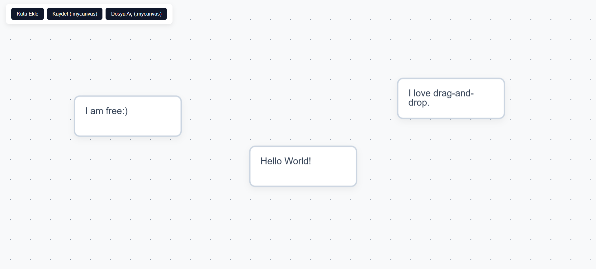

<div align="center">
  <h1>Canvas Studio</h1>
  <p>Drag-and-drop Canvas. Anytime, anywhere.</p>
</div>



##Features

- [x] In-place text editing
- [x] Custom file format
- [ ] Desktop version
- [ ] Methods for linking boxes

## Installation and Execution

You do not need to perform any installation to run the project.

1. Clone the repository or download it as a ZIP file:
   ```bash
   git clone https://github.com/Roi-0853/canvas-studio.git
   ```
2. Double-click the `index.html` file inside the folder to open it in your browser.

> **Note:** Since the project uses ES6 modules (`import/export`), it is recommended to use the VS Code **Live Server** extension or a simple local server instead of double-clicking directly, due to certain browser security policies (CORS).

